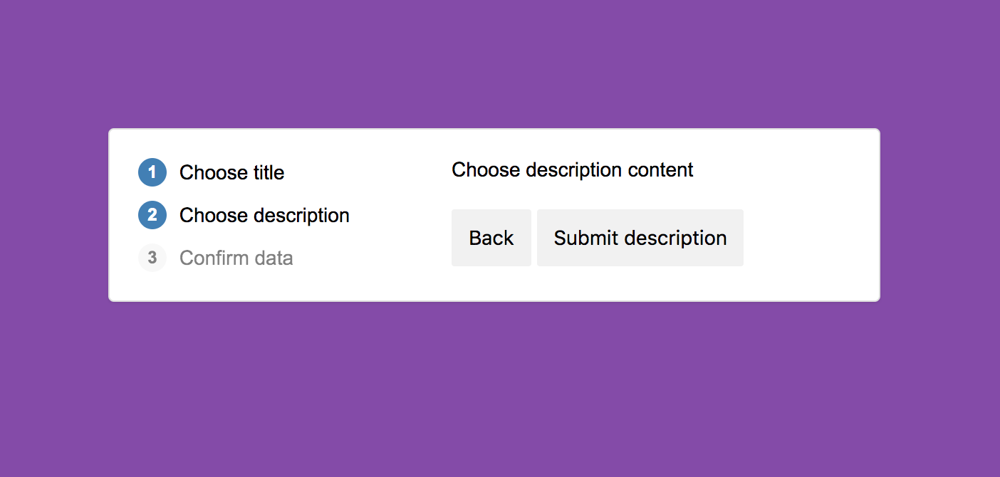
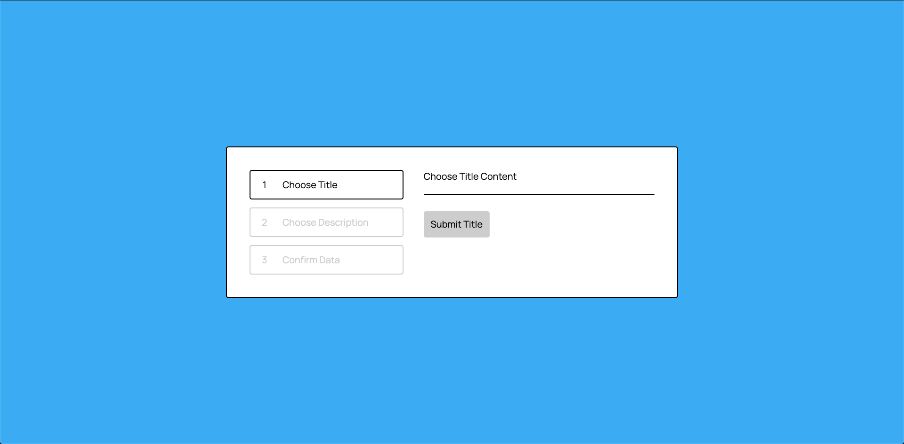

# FrontLoops Challenge 4 - JavaScript
## Loop 1 - Step 4

[Link to Completed Web Page](https://brianhyun.github.io/frontloops-js-challenge4/)

The challenge was to recreate the webpage/interaction as presented in the mp4 file provided by FrontLoops.

### FrontLoops Reference Screenshot - Desktop

### Demo

### Personal Screenshot - Desktop

*Definitely needs to be refactored.*

